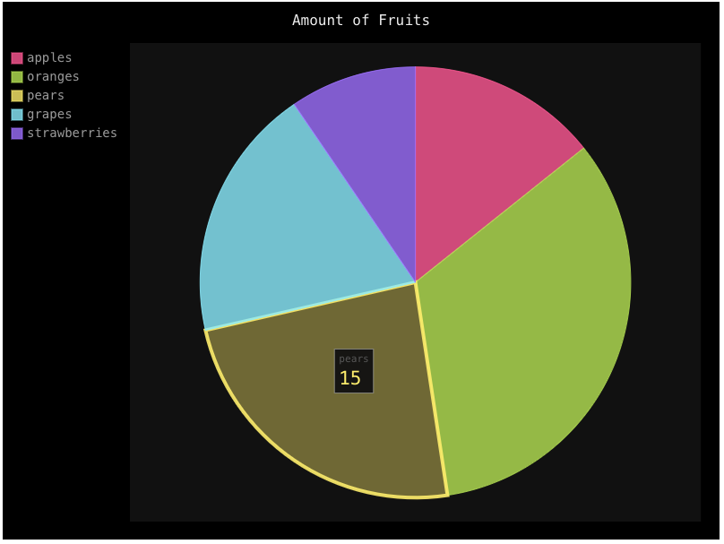

*(This is a mirror of my [post on Medium](https://medium.com/hackernoon/server-rendered-charts-in-django-2604f903389d), originally published on 03 Sep 2017.)*

Say, you’re building a Django-powered web application and you have some data you want to visualize. How do you do it? The most popular option is to pick a front-end charting library, have the back-end send the dataset (either through an API or directly passing it to the template) to the front-end, and render the chart in the browser. This approach allows the front-end to do most of the heavy lifting, thereby reducing the strain on your server.

But... What if you don’t want to deal with Javascript? What if the library you pick requires a license for commercial use (e.g. Highcharts, Amcharts, etc.)? What if you just need something quick?

Enter the alternative approach: render the chart on the back-end and insert the rendered HTML/SVG in the template. No Javascript, everything in Python, no front-end maintenance for your charts required. I’ll be showing you how to do this with [Pygal](http://pygal.org/en/stable/).

Pygal supports [many different types of charts](http://pygal.org/en/stable/documentation/types/index.html) (even maps!), along with a powerful [configuration system](http://pygal.org/en/stable/documentation/configuration/chart.html) and built-in styles (no need to fiddle with JS/CSS here). It also lets you [output the chart](http://pygal.org/en/stable/documentation/output.html) in many different ways.

## First, let’s install Pygal:

```sh
$ pip install pygal
```

I will be skipping Django project set-up and assuming you either have an existing project to work with, or you know how to get one running. We will need some data to work with, so I’ll create a model with mock data:

```python
# models.py
from django.db import models

class Fruit(models.Model):
    name = models.CharField(max_length=255)
    amt = models.IntegerField()

    def __str__(self):
        return self.name

# Insert mock data
$ python manage.py shell
>>> from charts_demo.models import Fruit
>>> Fruit(name='apples', amt=9).save()
>>> Fruit(name='oranges', amt=21).save()
>>> Fruit(name='pears', amt=15).save()
>>> Fruit(name='grapes', amt=12).save()
>>> Fruit(name='strawberries', amt=6).save()
```

Now, here’s the fun part — there’s really only three steps required to get everything working:

### 1. Create a Pygal chart

I like to keep my charts and views separate — chart generation and any data queries should not be in the view. Create a new file in your app’s directory (same as your `models.py`, `views.py`, etc.) named `charts.py` and put all chart-related logic in here, like so:

```python
# charts.py
import pygal

from .models import Fruit


class FruitPieChart():

    def __init__(self, **kwargs):
        self.chart = pygal.Pie(**kwargs)
        self.chart.title = 'Amount of Fruits'

    def get_data(self):
        '''
        Query the db for chart data, pack them into a dict and return it.
        '''
        data = {}
        for fruit in Fruit.objects.all():
            data[fruit.name] = fruit.amt
        return data

    def generate(self):
        # Get chart data
        chart_data = self.get_data()

        # Add data to chart
        for key, value in chart_data.items():
            self.chart.add(key, value)

        # Return the rendered SVG
        return self.chart.render(is_unicode=True)
```

### 2. Generate the chart’s SVG pass it to template context
```python
# views.py
from django.views.generic import TemplateView
from pygal.style import DarkStyle

from .charts import FruitPieChart


class IndexView(TemplateView):
    template_name = 'index.html'

    def get_context_data(self, **kwargs):
        context = super(IndexView, self).get_context_data(**kwargs)

        # Instantiate our chart. We'll keep the size/style/etc.
        # config here in the view instead of `charts.py`.
        cht_fruits = FruitPieChart(
            height=600,
            width=800,
            explicit_size=True,
            style=DarkStyle
        )

        # Call the `.generate()` method on our chart object
        # and pass it to template context.
        context['cht_fruits'] = cht_fruits.generate()
        return context
```

### 3. Include it in template


The chart’s SVG is now available through `{{ cht_fruits|safe }}`. The [`safe`](https://docs.djangoproject.com/en/1.11/ref/templates/builtins/#safe) filter is required here; Django would escape the SVG otherwise.

```html
<!DOCTYPE html>
<html lang="en">
<head>
  <meta charset="UTF-8">
  <meta name="viewport" content="width=device-width, initial-scale=1.0">
  <meta http-equiv="X-UA-Compatible" content="ie=edge">
  <title>django-pygal</title>
</head>
<body>
  {{ cht_fruits|safe }}
  <script type="text/javascript" src="http://kozea.github.com/pygal.js/latest/pygal-tooltips.min.js"></script>
</body>
</html>
```

If you want tooltips to work, you’ll have to include the Pygal tooltips JS file:
```html
<script type="text/javascript" src="http://kozea.github.com/pygal.js/latest/pygal-tooltips.min.js"></script>
```

### And here’s the rendered chart:


